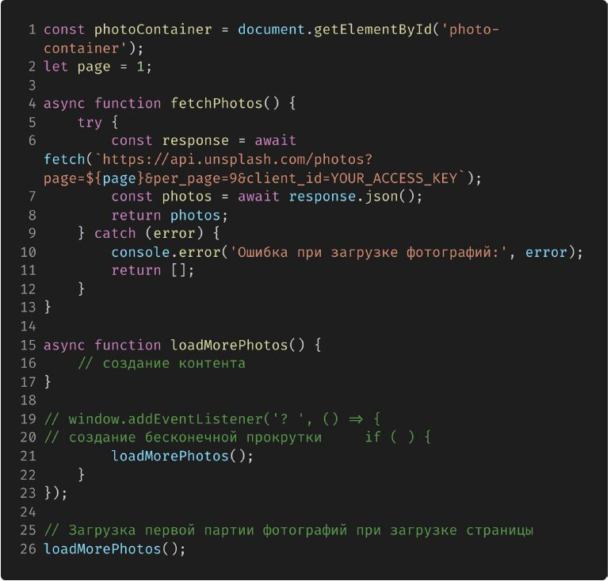

# Сетевые запросы

## Задание 1 (тайминг 35 минут)

Вы разрабатываете интернет-магазин и хотите добавить функциональность динамического фильтрации товаров по категориям. У вас есть форма с выпадающим списком (select), в котором пользователь может выбрать категорию товаров. При выборе категории товаров, необходимо динамически обновлять список отображаемых товаров на странице, чтобы пользователь виделтолько товары из выбранной категории.

1. Создайте интерфейс веб-страницы, который включает в себя
следующие элементы:

- Выпадающий список (select) с категориями товаров.
- Список товаров, который будет отображать товары в соответствии с выбранной категорией.
- Каждый товар в списке должен содержать название и категорию.

2. Используйте HTML для создания элементов интерфейса.

## Задание 1 (продолжение)

1. Используйте JavaScript для обработки событий:
- При выборе категории товаров в выпадающем списке, форма должна следить за изменениями.
- Динамически обновите список товаров на странице, чтобы отображать только товары из выбранной категории.
2. Создайте объекты товаров и их категорий для имитации данных магазина.
3. Стилизуйте элементы интерфейса с помощью CSS для улучшения внешнего вида.

## Задание 2. Бесконечная лента фотографий

Для создания бесконечной ленты с фотографиями с использованием Unsplash API, выполните следующие шаги:
1. Зарегистрируйтесь на Unsplash:
- Перейдите на веб-сайт Unsplash (https://unsplash.com/).
- Нажмите кнопку "Join" или "Регистрация", чтобы создать аккаунт, если у вас его еще нет.
- Войдите в свой аккаунт Unsplash.
2. Создайте приложение:
- После входа в аккаунт Unsplash, перейдите на страницу разработчика Unsplash (https://unsplash.com/developers).
- Нажмите "New Application" (Новое приложение).
- Заполните информацию о вашем приложении, такую как имя, описание и сайт (вы можете использовать http://localhost для тестового сайта).
- После заполнения информации, нажмите "Create Application" (Создать приложение).
3. Получите API-ключ:
- После создания приложения, вы получите API-ключ. Этот ключ будет отображаться в вашей панели управления приложением.
- API-ключ представляет собой строку вида YOUR_ACCESS_KEY. Скопируйте его.
4. Измените код HTML и JavaScript:
- Откройте вашу HTML-страницу в текстовом редакторе или интегрированной среде разработки.
- Замените 'YOUR_ACCESS_KEY' в коде JavaScript на ваш собственный API-ключ.

F6ooh4OGkV_p0W4agY3b6DpvRjBZmH0mtl27Vn7a8Zs

## Задание 2 (продолжение)
Создайте HTML-страницу со следующей структурой:

Теперь давайте напишем JavaScript-код для загрузки фотографий из Unsplash API и отображения их на странице. Вставьте следующий код внутри блока `` в вашем HTML- файле:

Реализуйте бесконечную ленту с фотографиями.